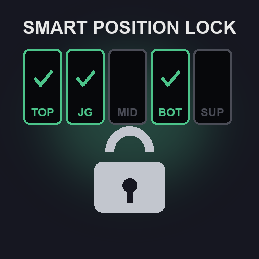

# Smart Position Lock — 智能位置锁定（团战经理 2 / Teamfight Manager 2）

双方只会选还能放进剩余空位的英雄。**不用任何设置**：装上就生效。原生 Mod（稳定版 Mod API，游戏 0.6 及以上）。

- **英雄能打的位置自动判断**：选人卡片上游戏标注的两个主位置（英雄 Mod 给英雄设置的位置直接生效），加上本存档里它实际打过足够多的位置（大会比赛和单排都算）。主位置在你第一次打开选人界面时学会，存在 Mod 文件夹的 `positions.json` 里，之后 AI 之间的比赛也会用。
- **按整队判断**：不会同时选两个只能打上路的英雄；能打多个位置的英雄会被安排到还空着的位置上。
- **AI 按位置选**：选人界面上每一方的五个选手栏按“上单、打野、中单、下路、辅助”排列，一方的第 k 手英雄会给第 k 个位置的选手。所以 AI 的第 1 手只会选能打上单的英雄，第 2 手只选能打野的，依此类推。
- **你自己按整队判断**：你选人时，放不进剩余空位的英雄卡片会盖上一把锁，点不了；你可以先选再在换位阶段调整。
- **禁用不受限制。没有任何合适的英雄时自动全部放开**，选人永远不会卡住。不知道你是蓝方还是红方时，你这边什么都不锁。
- 和 **Patch Meta AI** 一起用：它的推荐会跳过被锁住的英雄。以前 Patch Meta AI 学到的英雄主位置会自动接过来。
- 不要和另一个位置锁定 Mod（Champion Position Lock）同时开：两个锁会叠加，英雄要同时满足两边才能选。

## 游戏内设置面板（F7）

任何界面按 **F7** 打开（再按 F7、Esc 或右上角 ✕ 关闭）：
- 上面四个开关：总开关、锁定 AI 选人、锁定我自己选人、参考存档战绩；
- 下面是选人界面出现过的所有英雄（每页 24 个，◀ ▶ 翻页）：点某个位置就打开/关闭这个英雄能打的这个位置（绿色 = 能打），改过的英雄标“手动”，点 ↺ 恢复自动判断。

每次点击立即生效，并自动写进 `settings.ini`（文件里的其他内容和注释都保留）。

## 设置：`settings.ini`

第一次运行时在 Mod 文件夹里自动生成，改完保存几秒内生效，不用重启。上面的面板改的就是这个文件，也可以直接编辑。

| 段落 | 键 | 默认 | 作用 |
|---|---|---|---|
| `[lock]` | `enabled` | on | 总开关 |
| | `ai` | on | 限制 AI 选人 |
| | `player` | on | 限制你自己选人（锁住放不下的卡片） |
| `[history]` | `history` | on | 把本存档里实际打过的位置也算进去；`off` = 只用卡片上的两个主位置 |
| | `min_games` / `share` | 8 / 0.15 | 英雄至少打过这么多场、某位置占比至少这么多，才算它能打这个位置 |
| `[positions]` | 英雄 id | （空） | 手动指定位置，例如 `ahri=Mid,Support`，完全替代自动判断 |

## 英雄联盟英雄（league Mod）

league Mod 没有给英雄设置位置，选人卡片上显示的大多是“上路+打野”，自动判断用不上。[`presets/league_positions.ini`](presets/league_positions.ini) 按英雄联盟官方主位置整理好了全部 71 个英雄：把它的内容复制到 `settings.ini` 的 `[positions]` 段即可，每行后面有中文名，想改哪个英雄直接改。

## 出问题时

Mod 文件夹里的 `diag.log` 记录了 Mod 读到了什么，以及锁有没有起作用：
- `[draft]`：AI 每一手是给哪个位置选的、锁掉了哪些英雄；
- `[check]`：选人界面上每一方选的英雄能不能一人一个位置放下；
- `[result]`：本次游戏里打完的每场大会比赛，每个英雄实际打了哪个位置（换位之后的最终结果）。
每次启动游戏重写，上一次的保留为 `diag.prev.log`。

## English

Teams only pick champions that can still take one of their open positions - nothing to set up. A champion's positions are its two main positions as the game shows them on its ban/pick card (so a champion mod's positions just work), learned on the ban/pick screen and kept in `positions.json`, plus every position it has really played in your save (`min_games` games, `share` of them there). A pick is legal when the team's picks and the candidate can still be seated one per position. The AI's picks are held to it by a draft score hook; your own by a lock over each card that does not fit, which takes the click. Bans are free, and when nothing on offer fits, everything does - a draft never gets stuck. Your own positions for any champion go in `settings.ini` (`[positions]`, e.g. `ahri=Mid,Support`) - or press **F7** in game for a settings panel that writes them for you.

- Build with `cargo build --release` (Windows) or `tools/build.sh` (packages `dist/smart_position_lock-<version>.zip`).
- MIT licensed. `vendor/mod-api-stable` is TeamSamoyed's SDK.
